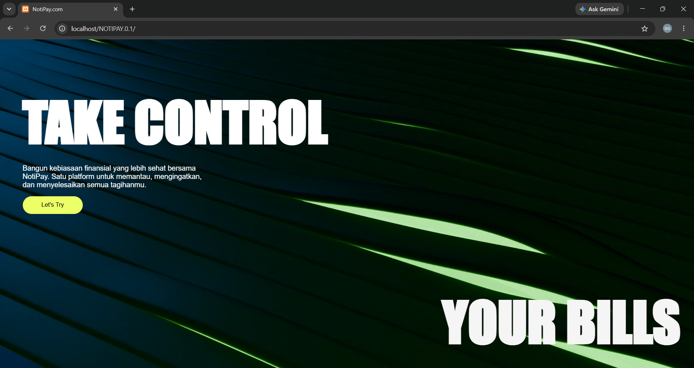

# Notipay

Notipay adalah aplikasi web pengingat dan pelacak tagihan (bill reminder) yang membantu pengguna mengelola tagihan bulanan secara terorganisir. Aplikasi ini memungkinkan pengguna mengelompokkan tagihan ke dalam kategori, memantau status pembayaran, serta mendapatkan indikator visual saat tagihan mendekati atau melewati tanggal jatuh tempo.



## Deskripsi

Notipay dibangun untuk menjawab masalah umum dalam manajemen keuangan pribadi: banyaknya tagihan rutin (kos, kuliah, langganan, utang, dan lain-lain) yang sulit dipantau secara manual. Setiap pengguna memiliki ruang data terpisah — kategori dan tagihan yang dibuat oleh satu akun tidak dapat diakses oleh akun lain. Setiap tagihan dapat ditandai sebagai "Lunas" atau "Belum", dan sistem secara otomatis memberi badge warna berdasarkan urgensi tanggal jatuh tempo, sehingga pengguna dapat langsung mengetahui tagihan mana yang perlu segera dibayar.

Project ini dikembangkan untuk memenuhi capaian pembelajaran mata kuliah Praktikum Pemrograman Web, dengan fokus pada penerapan pemrograman web sisi server (PHP) yang terhubung dengan basis data relasional (MySQL), meliputi autentikasi pengguna, operasi CRUD, relasi antar tabel, dan manajemen sesi.

## Fitur

### Autentikasi & Manajemen Akun
- Registrasi akun baru dengan validasi username unik
- Login dengan verifikasi password yang telah di-hash (`password_hash` / `password_verify`)
- Manajemen sesi menggunakan PHP Session
- Logout dengan penghancuran sesi (`session_destroy`)

### Manajemen Kategori Tagihan
- Menambahkan kategori tagihan baru (misalnya Kos, Kuliah, Langganan)
- Melihat daftar seluruh kategori milik akun yang sedang login, terurut alfabetis
- Menghapus kategori, dengan validasi kepemilikan agar hanya pemilik kategori yang dapat menghapusnya
- Penghapusan kategori otomatis turut menghapus seluruh tagihan di dalamnya (cascading delete melalui `ON DELETE CASCADE`)

### Manajemen Tagihan
- Menambahkan tagihan baru ke dalam kategori tertentu, meliputi nama tagihan, jumlah nominal, dan tanggal jatuh tempo
- Melihat daftar tagihan per kategori, terurut berdasarkan tanggal jatuh tempo terdekat
- Mengedit data tagihan (nama, jumlah, tanggal jatuh tempo, status)
- Menghapus tagihan, dengan validasi bahwa tagihan tersebut milik pengguna yang sedang login
- Menandai tagihan sebagai "Lunas" melalui satu aksi (`update_status.php`)

### Indikator Visual Jatuh Tempo
Setiap tagihan diberi badge warna otomatis berdasarkan status dan sisa waktu menuju jatuh tempo:
- Hijau — tagihan sudah lunas
- Merah — tagihan sudah melewati tanggal jatuh tempo
- Kuning — jatuh tempo dalam waktu dekat (≤ 3 hari)
- Abu-abu — belum mendekati jatuh tempo

### Keamanan & Isolasi Data
- Setiap query kategori dan tagihan dibatasi berdasarkan `id_user` dari sesi aktif, sehingga data antar akun tidak saling tumpang tindih
- Proteksi halaman: seluruh halaman inti (kecuali login/register) memeriksa status sesi dan mengalihkan ke halaman login jika belum terautentikasi
- Validasi kepemilikan data pada aksi edit, hapus, dan ubah status, untuk mencegah akses ke data milik akun lain

### Antarmuka
- Landing page dengan elemen visual (video hero) dan ajakan untuk memulai
- Tampilan berbasis Bootstrap 5 untuk form dan tabel data
- Tabel tagihan dengan badge status berwarna untuk kemudahan pemantauan

## Tech Stack

| Kategori | Teknologi |
|---|---|
| Bahasa Backend | PHP |
| Database | MySQL / MariaDB |
| Query Engine | MySQLi |
| Frontend | HTML, CSS, Bootstrap 5 |
| Autentikasi | PHP Session, `password_hash` / `password_verify` |

## Struktur Project

```
Notipay/
├── NOTIPAY.0.1/
│   ├── connect.php            # Koneksi ke database MySQL
│   ├── header.php             # Navbar & komponen header bersama
│   ├── index.php              # Landing page
│   ├── login.php              # Halaman & proses login
│   ├── register.php           # Halaman & proses registrasi
│   ├── logout.php             # Proses logout & penghancuran sesi
│   ├── main.php                # Daftar kategori tagihan milik user
│   ├── kategori.php           # Daftar tagihan dalam satu kategori
│   ├── tambah_kategori.php    # Form tambah kategori baru
│   ├── hapus_kategori.php     # Proses hapus kategori
│   ├── tambah_tagihan.php     # Form tambah tagihan baru
│   ├── edit.php                # Form edit tagihan
│   ├── hapus.php               # Proses hapus tagihan
│   ├── update_status.php      # Proses menandai tagihan sebagai lunas
│   ├── style.css               # Styling aplikasi
│   └── assets/                 # Aset media (video hero, dll.)
├── bill_reminder.sql          # Skema & data awal database
└── README.md
```

## Skema Database

Database: `bill_reminder`

**Tabel `users`**

| Kolom | Tipe | Keterangan |
|---|---|---|
| `id_user` | INT (PK, AUTO_INCREMENT) | ID unik pengguna |
| `username` | VARCHAR(100), UNIQUE | Nama pengguna |
| `password` | VARCHAR(255) | Password yang di-hash |

**Tabel `categories`**

| Kolom | Tipe | Keterangan |
|---|---|---|
| `id_category` | INT (PK, AUTO_INCREMENT) | ID unik kategori |
| `nama_category` | VARCHAR(50) | Nama kategori |
| `id_user` | INT (FK → users) | Pemilik kategori |

**Tabel `bills`**

| Kolom | Tipe | Keterangan |
|---|---|---|
| `id` | INT (PK, AUTO_INCREMENT) | ID unik tagihan |
| `nama_tagihan` | VARCHAR(100) | Nama tagihan |
| `jumlah` | DECIMAL(10,2) | Nominal tagihan |
| `tanggal_jatuh_tempo` | DATE | Tanggal jatuh tempo |
| `status` | ENUM('Lunas', 'Belum') | Status pembayaran |
| `id_category` | INT (FK → categories, ON DELETE CASCADE) | Kategori tagihan |
| `id_user` | INT (FK → users) | Pemilik tagihan |

Relasi: satu `user` memiliki banyak `categories`, dan satu `category` memiliki banyak `bills`. Penghapusan kategori akan menghapus seluruh tagihan di dalamnya melalui `ON DELETE CASCADE`.

Skema lengkap beserta data contoh tersedia di [`bill_reminder.sql`](./bill_reminder.sql).

## Cara Menjalankan

### Prasyarat

- PHP 7.4 atau lebih baru (server lokal seperti XAMPP/Laragon/MAMP)
- MySQL / MariaDB
- Web browser

### Langkah instalasi

1. **Clone / extract project** ke direktori root server lokal (misalnya `htdocs` pada XAMPP)
   ```bash
   git clone <repo-url>
   ```

2. **Siapkan database**
   - Jalankan MySQL/MariaDB (misalnya melalui XAMPP)
   - Buat database dengan nama `bill_reminder`
   - Import file `bill_reminder.sql` melalui phpMyAdmin atau terminal:
     ```bash
     mysql -u root -p bill_reminder < bill_reminder.sql
     ```

3. **Sesuaikan konfigurasi koneksi**
   Buka `NOTIPAY.0.1/connect.php` dan sesuaikan kredensial database jika diperlukan:
   ```php
   $host = "localhost";
   $user = "root";
   $pass = "";
   $db   = "bill_reminder";
   ```

4. **Jalankan aplikasi**
   - Pastikan Apache dan MySQL aktif
   - Akses melalui browser, misalnya:
     ```
     http://localhost/Notipay/NOTIPAY.0.1/index.php
     ```

## Cara Pakai

1. Buat akun baru melalui halaman **Register**, lalu login
2. Buat kategori tagihan (misalnya "Kos", "Kuliah", "Langganan")
3. Masuk ke kategori, lalu tambahkan tagihan beserta nominal dan tanggal jatuh tempo
4. Pantau status tagihan melalui badge warna pada tabel
5. Tandai tagihan sebagai **Lunas** setelah dibayar, atau edit/hapus data sesuai kebutuhan

## Catatan Pengembangan

Beberapa area yang dapat ditingkatkan pada versi berikutnya:

- Penerapan *prepared statements* secara konsisten di seluruh query untuk mencegah SQL injection (saat ini sebagian query sudah menggunakan `mysqli_real_escape_string`/`intval`, namun belum seragam di semua file)
- Notifikasi otomatis (email/push) mendekati tanggal jatuh tempo, sesuai dengan konsep "Notipay"
- Validasi input tambahan pada sisi server

## Lisensi

Project ini dibuat untuk keperluan pembelajaran dan bebas digunakan untuk tujuan pengembangan lebih lanjut.
